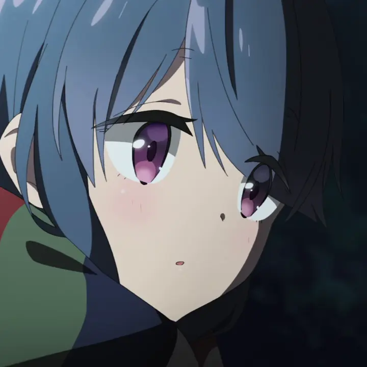

<p align="center">
   
   <h1 align="center">Shimarin</h1>
   <h3 align="center">Multipurpose discord bot</h3>
</p>

<p align="center">
   <a href="#overview">Overview</a>,
   <a href="#invite">Invite</a>,
   <a href="#host">Host</a>
</p>

## Overview

Shimarin is a discord bot, made using `Rust`. Bot is named after Shima Rin from
Yuru Camp manga series.

## Invite

You can invite the bot by
[this link](https://discord.com/api/oauth2/authorize?client_id=1038694628490235904&permissions=1806070770950&scope=applications.commands%20bot).
Type "/" to see commands!

## Run yourself

1. Create bot -
   [Discord developer portal](https://discord.com/developers/applications).

2. Install [rust](https://www.rust-lang.org/).

3. Set up your [.env](.env.sample) (sample in [.env.sample](.env.sample)).

   ```env
   DISCORD_TOKEN="DISCORD_BOT_TOKEN_FROM_<https://discord.com/developers/applications>"
   ```

4. Start bot - `cargo run -r`

There is a better way, but lol.
